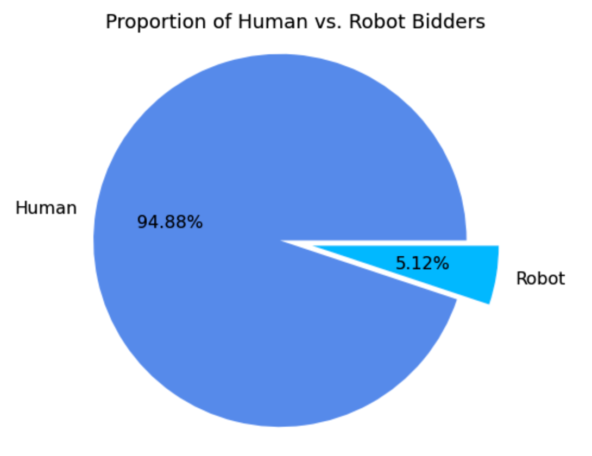
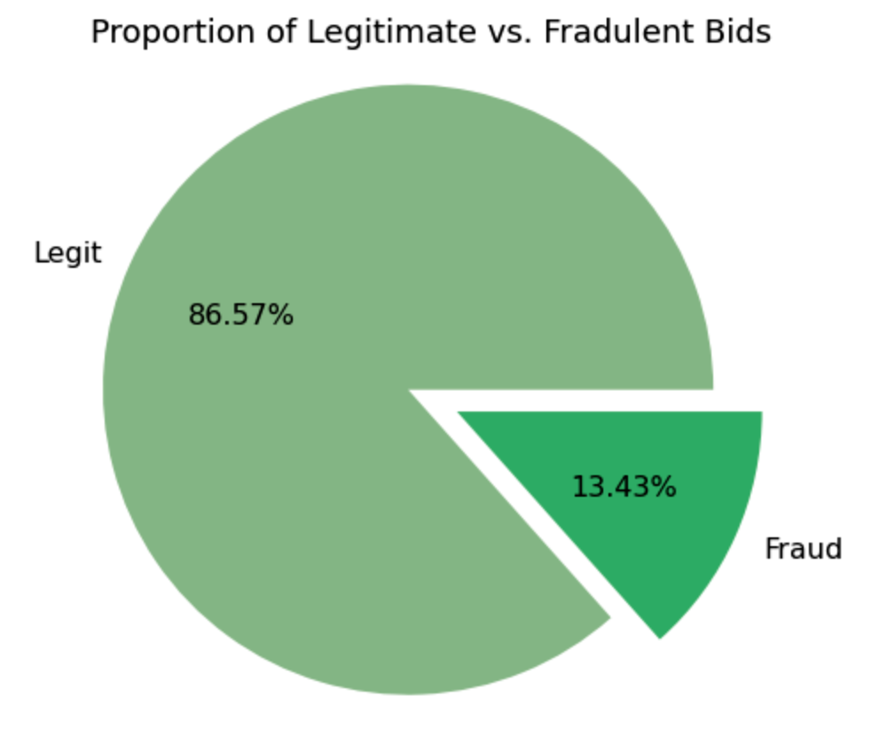
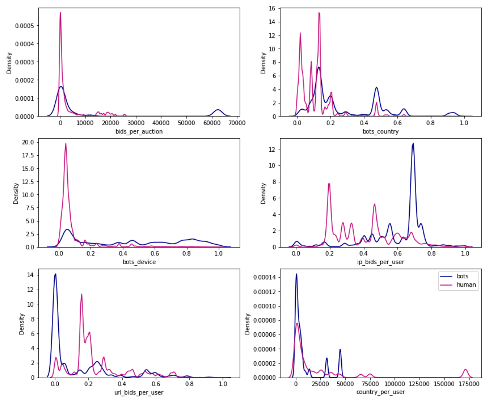
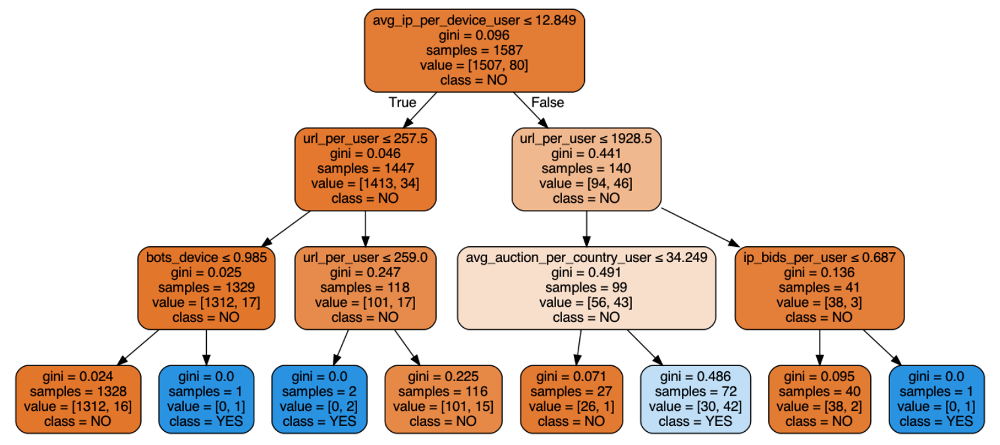

# Auction Fraud Detection
## Is it Human or Robot?
### Predicting fraud through classification machine learning models and feature engineering.

**Problem Statement:**

On an auction website, human bidders are becoming increasingly frustrated with their inability to win auctions vs. their software-controlled counterparts. As a result, usage from the site's core customer base is plummeting. In order to rebuild customer happiness, the site owners need to eliminate computer generated bidding from their auctions.

**Objective:**

The goal is to identify online auction bids that are placed by "robots", helping the site owners easily flag these users for removal from their site to prevent unfair auction activity.

## 1. Data Acquisition
[Data Wrangling Report](https://github.com/gabriellewald/auction-fraud-detection/blob/main/notebooks/1_data_wrangling.ipynb)

**Data Source:**
This project idea is part of an Engineering competition created by Facebook and Kaggle in 2015. The provided dataset has been said to be one of the richest data of its kind and a world class machine learning problem with great potential for feature engineering. The data was retrieved from the Kaggle website in csv format.

There are two datasets. The bidder dataset includes a list of bidder information, including their unique id, payment account, address, and outcome. The bid dataset includes 7.6 million bids on different auctions - Bids are all made by mobile devices. And, the online auction platform has a fixed increment of dollar amount for each bid, so it doesn't include an amount for each bid.

Challenges included: obfuscated variables to protect privacy and variables that represent unique identifiers. There is a time variable and categorical variables that represent merchandise, country and cellphone devices.

The datasets were merged on bidder_id to make it easier to access information. Although the dataset was fairly clean, there were 29 missing data points for several variables that were mapped to human bids. Since the interest is in identifying robot bids, the rows corresponding to these missing values were dropped. All columns were kept. Regarding the obfuscated fields, they are an issue for interpretability, but are also going to be useful when performing EDA and feature engineering. The columns were rearranged for convinience and the new DataFrame was saved to csv.

## 2. Exploratory Data Analysis
[Exploratory Data Analysis Report](https://github.com/gabriellewald/auction-fraud-detection/blob/main/notebooks/2_exploratory_data_analysis.ipynb)

**Initial Hypothesis:**

1. Total number of bids: Robots might have significantly higher number of bids compared to humans.
2. Number of bids per auction: Robots might have higher number of bids each auction.
3. Distinct IPs: Robots might bid from more diverse IP addresses.
4. Merchandise: Robots might bid more often on certain merchandises.

 

The data is highly unbalanced from the bidders and bids perspective. Humans represent 94.88% of the data, while only 5.12% are robots. Legitimate bids represent 86.52% of the data, while 13.43% are fraudulent. There are 12,740 auctions represented in this dataset, and over 3 million bids in the train dataset. Bids come from 5,729 device models in 199 countries, 663,873 URLs and 1,030,950 IP addresses. There are 10 distinct merchandise categories.

**Findings:**

The initial hypotheses held true. There is a significant difference in the mean and median number of occurrences for independent variables between human and robot. The mean number of bids per robot is 4004 and for humans is 1443, the median number of bids per robot is 716, while for humans is only 14. The mean number of IP address per robot is 2388, for humans is 581, the median for robots is 290, and 11 for humans. A similar pattern occurs in the other variables (number of auctions, countries, devices, and urls) with robots having a higher number of occurrences associated with their bidder id.

## 3. Feature Engineering
[Feature Engineering Report](https://github.com/gabriellewald/auction-fraud-detection/blob/main/notebooks/3_feature_engineering.ipynb)

Informed by the EDA, the major differences between robots and humans were taken into account. The features were created around the number of occurrences, mean and median which showed to be significantly different for humans and robots behavior in the analysis. Some of the features created:

- Number of bids per auction by bidder_id
- Number of countries per bidder_id
- Number of IP addresses per bidder_id
- Number of URLs per bidder_id
- Number of same IP addresses per auction for bidder_id
- Mean number of bids per bidder_id
- Median number of bids per bidder_id
- Mean number of countries per bidder_id
- Median number of countries per bidder_id
- Mean number of IP per device per bidder_id

 

## 4. Preprocessing and Modeling
[Preprocessing and Modeling Report](https://github.com/gabriellewald/auction-fraud-detection/blob/main/notebooks/4_pre_processing_modeling.ipynb)

- Total off 23 features were created summarizing information at the bidder_id level.
- The merchandise column was remapped to have one product per column with the number of bids for each bidder.
- Dataset was filtered at bidder_id level, 1984 rows.

**Models:**

- Logistic Regression
- Random Forest
- Decision Trees

Based on an initial modeling generated to identify the most promising algorithm accuracy, Random Forest Classifier comes first, followed by Logistic Regression, and lastly the Decision Tree Classifier.

**Evaluation:**

The target variable (robot or human) is not balanced and the data is skewed, for this reason accuracy is not necessarily the best metric of evaluation. We want to consider metrics like Precision, Recall, and F-score.

First though, let's have a better understanding of the terms that form the basis for these.

- True Positive: label predicted 'robot' and it is in fact 'robot' (predicted 1.0 and it's 1.0).
- True Negative: label was predicted 'human' and it is in fact 'human' (predicted 0.0 and it's 0.0).
- False Positive: label was predicted 'robot' but it is in fact 'human' (predicted 1.0 but it's 0.0). Type 1 error or incorrect rejection of Null Hypothesis.
- False Negative: label was predicted 'human' but it is in fact 'robot' (predicted 0.0 but it's 1.0). Type 2 error or failure to reject of Null Hypothesis.

What are the best metrics to evaluate our model?

- Precision: ability of the model to return only relevant instances. In this case, we want to minimize false negative, and don't want 'robots' to be classified as 'humans'.
- Recall: ability of the model to identify all relevant instances, that is True Positive Rate, aka Sensitivity. We want the least false positive, minimize 'humans' classified as 'robots'.
- F1 Score: returns a harmonic mean of precision and recall, indicating a balance between Precision & Recall. Therefore, a model that has a high F1 score can be a good model for us too.

## 5. Conclusion

Precision and recall are important metrics in this case. Our model ideally should correctly identify the highest number of 'robots' as 'robots', that is high True Positive rate. And, it should minimize type 1 error and not have 'humans' classified as 'robots'. In summary, we are looking for the model that returns the highest value of true positives and a low value for false positives. Since, the goal here is to identify 'robot' bidders (those generating fraudulent bids), the preference is for a model with high True Positive. This is another way to say we wish for Recall to be higher, so 'robots' can be correctly classified. We still want to keep false positive low, but in case we misclassify a human for a robot, it won't be a damaging as keeping 'robot' bidders on the website.

Considering it all, the best performing model was the Decision Tree Classifier, which classified the highest number of robots correctly.

 

