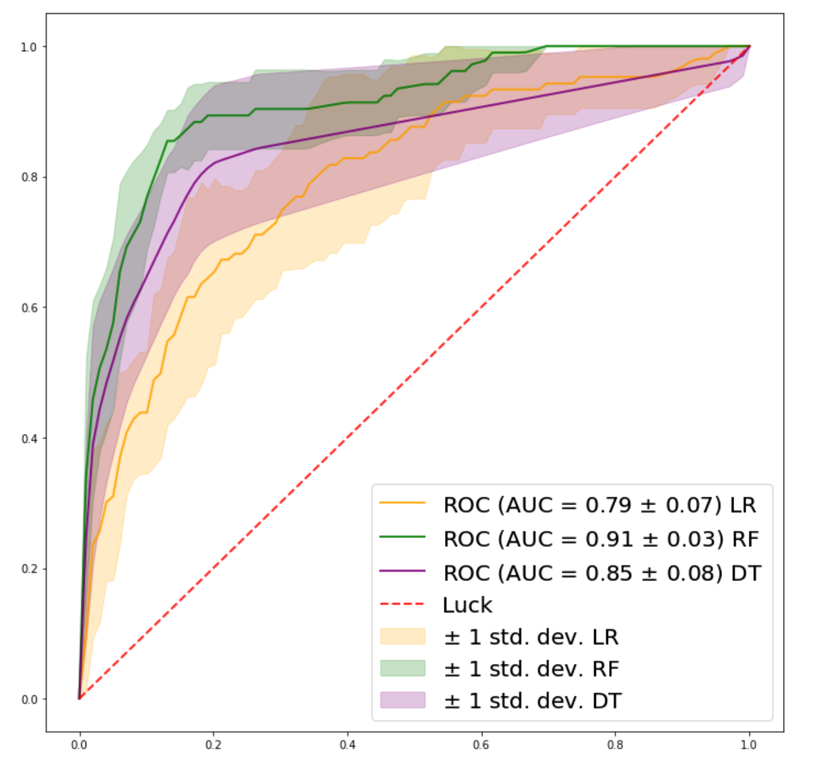

# Auction Fraud Detection
## Human or Robot?
### Predicting fraud through classification machine learning models and feature engineering.

**Problem Statement:**

On an auction website, human bidders are becoming increasingly frustrated with their inability to win auctions vs. their software-controlled counterparts. As a result, usage from the site's core customer base is plummeting. In order to rebuild customer happiness, the site owners need to eliminate computer generated bidding from their auctions.

**Objective:**

The goal is to identify online auction bids that are placed by "robots", helping the site owners easily flag these users for removal from their site to prevent unfair auction activity.

## 1. Data Acquisition
[Data Wrangling Report](https://github.com/gabriellewald/auction-fraud-detection/blob/main/notebooks/1_data_wrangling.ipynb)

**Data Source:**
This project idea is part of an Engineering competition created by Facebook and Kaggle in 2015. The provided dataset has been said to be one of the richest data of its kind and a world class machine learning problem with great potential for feature engineering. The data was retrieved from the Kaggle website in csv format.

There are two datasets. The bidder dataset includes a list of bidder information, including their unique id, payment account, address, and outcome. The bid dataset includes 7.6 million bids on different auctions - Bids are all made by mobile devices. And, the online auction platform has a fixed increment of dollar amount for each bid, so it doesn't include an amount for each bid.

Challenges included: obfuscated variables to protect privacy and variables that represent unique identifiers. There is a time variable and categorical variables that represent merchandise, country and cellphone devices.

The datasets were merged on bidder_id to make it easier to access information. Although the dataset was fairly clean, there were 29 missing data points for several variables that were mapped to human bids. Since the interest is in identifying robot bids, the rows corresponding to these missing values were dropped. All columns were kept. Regarding the obfuscated fields, they are an issue for interpretability, but are useful when performing EDA and feature engineering.

## 2. Exploratory Data Analysis
[Exploratory Data Analysis Report](https://github.com/gabriellewald/auction-fraud-detection/blob/main/notebooks/2_exploratory_data_analysis.ipynb)

**Initial Hypothesis:**

1. Total number of bids: Robots might have significantly higher number of bids compared to humans.
2. Number of bids per auction: Robots might have higher number of bids each auction.
3. Distinct IPs: Robots might bid from more diverse IP addresses.
4. Merchandise: Robots might bid more often on certain merchandises.

 

The data is highly unbalanced from the bidders and bids perspective. Humans represent 94.88% of the data, while only 5.12% are robots. Legitimate bids represent 86.52% of the data, while 13.43% are fraudulent. There are 12,740 auctions represented in this dataset, and over 3 million bids in the train dataset. Bids come from 5,729 device models in 199 countries, 663,873 URLs and 1,030,950 IP addresses. There are 10 distinct merchandise categories.

**Findings:**

The initial hypotheses held true. There is a significant difference in the mean and median number of occurrences for independent variables between human and robot. The mean number of bids per robot is 4004 and for humans is 1443, the median number of bids per robot is 716, while for humans is only 14. The mean number of IP address per robot is 2388, for humans is 581, the median for robots is 290, and 11 for humans. A similar pattern occurs in the other variables (number of auctions, countries, devices, and urls) with robots having a higher number of occurrences associated with their bidder id.

 

## 3. Feature Engineering
[Feature Engineering Report](https://github.com/gabriellewald/auction-fraud-detection/blob/main/notebooks/3_feature_engineering.ipynb)

Informed by the EDA, the major differences between robots and humans were considered. Features were created around the number of occurrences, mean and median which showed to be significantly apart in the analysis. These features will be fed into the classification model so the model can learn to classify the bidders into robots or humans. Some of the features created:

- Mean/median number of bids per auction per user
- Number of unique auctions per user
- Proportion of unique ip addresses to bids per user
- Mean/median number of IP addresses per auction per user
- Total unique ip and url per user
- Mean/median number of url per device per user
- Mean number of auctions for each country per user

 

## 4. Preprocessing and Modeling
[Preprocessing and Modeling Report](https://github.com/gabriellewald/auction-fraud-detection/blob/main/notebooks/4_pre_processing_modeling.ipynb)

- 16 features were created summarizing information at the bidder_id level.
- The merchandise column was remapped to have one product per column with the number of bids for each bidder.
- Dataset was filtered at bidder_id level, 1984 rows.
- The original columns were dropped, except for the outcome column.
- Split into train (80%) and test data (20%)

**Models:**

- Logistic Regression
- Random Forest
- Decision Trees

**Evaluation:**

What are the best metrics to evaluate our models?

- Recall is the ability of the model to identify all relevant instances, that is True Positive Rate, aka Sensitivity. It quantifies the number of correct positive predictions made out of all positive predictions that could have been made. We want the highest number of robots correctly classified as robots.
  - Recall = True Positives/ (True Positives + False Negatives)

- AUC measures the ability of a classifier to distinguish between classes. The higher the AUC, the better the performance of the model at distinguishing between the positive and negative classes. It is plotted with Sensitivity against False Positive rate (1-Specificity). An AUC near 1 means the model has a good measure of separability.

 

## 5. Conclusion

Recall and AUC are the metrics we want to consider. In fraud detection it is critical to correctly classify fraud or what is causing frauds, in this case we want to identify the “robot” users. Because Recall is the measure of relevant instances (True Positives) it is a good metric to evaluate the models. We want a model with a high Recall rate.

The AUC metric provides an understanding of how the model is performing with True Positives and False Positives (humans classified as robots). Ideally the best model classifies all 'robots' as 'robots' (True Positive), and it does not make type 1 error (False Positive), classifying 'humans’ as 'robots'. A model that correctly identifies all robots as robots and makes no type I error would return an AUC of 1. That’s what we want to see, an AUC score that is near 1.

**In case of misclassification**, the preference is for type I error (False Positive: humans classified as robots) vs type II error (False Negative: robots classified as humans). The cost of keeping robots on the website is more costly than having humans misclassified as robots banned *temporarily* from the website. Keeping robots misclassified as humans on the website will not improve clients satisfaction.

In addition, in case of type I error, the **use of CAPTCHA can be a good approach**, allowing humans misclassified as robots to pass through the initial ban and continue to use the website.

Considering all, the Decision Tree classifier has the highest True Positive rate (Recall) and a good AUC score, and the Random Forest classifier has the highest AUC score. However, given the unbalanced nature of this problem the best performing model in identifying True Positives (Decision Tree classifier) still only identifies 8 out of 23 robots. That’s a 35% success rate, which is not good enough to move to production. If requiring more data was possible, it would be useful to have a larger dataset. The sample size for this problem is relatively small (1984 users with 103 labeled robots), with 80% reserved for training, the test data is left with 397 users with 23 labeled as robots. 

Nevertheless, there are still some things that can be done with the current data to further improve the models like:

- Create new features from the time column which due to time constraint I was not able to add. But time features showed to be very useful for other Kaggle competitors working on this same problem. Features like the following are very likely to improve classification:
- Maximum number of bids made within a 20 minute span;
- Median time between a user’s bid and that user’s previous bid;
- Proportion of bidder’s bid by day (~9 days of bid);
- Number of simultaneous bids;
- Try other machine learning models like XGBoost, Support Vector Machine and Naive Bayes.

For more details:
[Full Report](https://github.com/gabriellewald/auction-fraud-detection/blob/main/report-auction-fraud-detection.pdf)

## Thank you note:
**Thanks [Nadav](https://github.com/nrindler), for your support and mentoring.**
